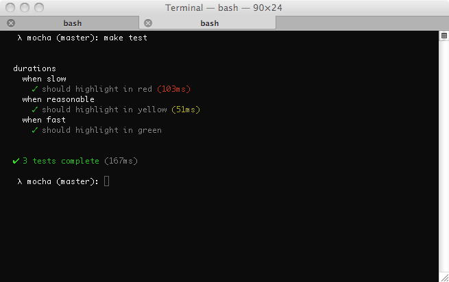

<h2 id="test-duration">Test duration</h2>

  Most of the reporters support some form of displaying
  test duration, as well as flagging tests that are slow,
  as shown here with the "spec" reporter:

<h2 id="test-duration">テストの実行時間</h2>

  テストレポーターのほとんどが、テストの実行時間に応じていくつかの表示形式をサポートしており、
  実行が遅ければフラグを立てる等、スペックのレポーターとして表示される。:

   
